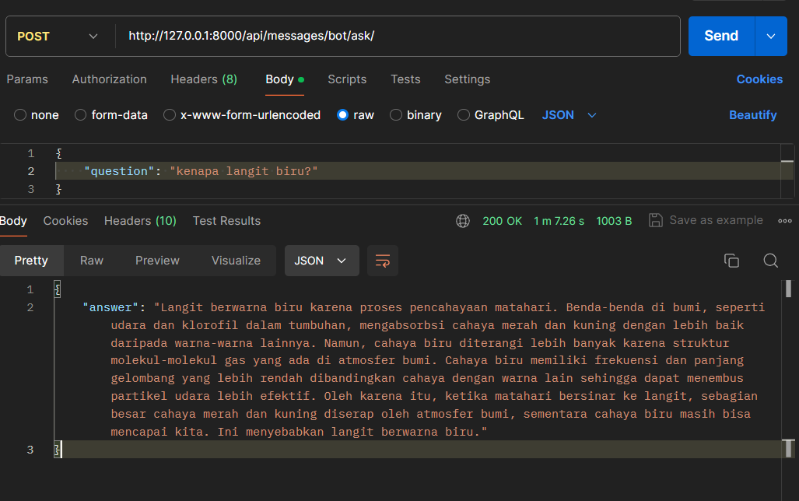

# Rest API Chatbot

Chatbot Project using [Django + Postgresql + Ollama] for beginner



This guide will help you set up the Chatbot project using Django and Ollama's `qwen2:1.5b` model.

## Prerequisites

- Recommended to use Python 3.12.1 for a smooth experience.
- Ensure you have PostgreSQL installed and running.

## Ollama Installation

Make sure you can run Ollama by following the instructions on the [Ollama installation page](https://ollama.com/download).

## Project Setup

### 1. Install Virtual Environment

```sh
python -m venv venv
```

### 2. Activate Virtual Environment

- **Windows**:
  ```sh
  .\venv\Scripts\activate
  ```
- **macOS/Linux**:
  ```sh
  source venv/bin/activate
  ```

### 3. Install Requirements

Install the requirements:

```sh
pip install -r requirements.txt
```

### 4. Initialize Django Project

```sh
django-admin startproject chatbot
cd chatbot
django-admin startapp messaging
```

### 5. Configure Database

Edit the `DATABASES` setting in `chatbot/settings.py` to configure your PostgreSQL database:

```python
DATABASES = {
    'default': {
        'ENGINE': 'django.db.backends.postgresql',
        'NAME': 'chatbot',
        'USER': 'your_db_user',
        'PASSWORD': 'your_db_password',
        'HOST': 'your_db_host',
        'PORT': 'your_db_port',
    }
}
```

### 6. Apply Migrations

```sh
python manage.py makemigrations
python manage.py migrate
```

### 7. Run the Server

```sh
python manage.py runserver
```

## Testing the Setup

You can test the API using Postman or `curl`.

### Using Postman

- URL: `http://localhost:8000/api/messages/ask`
- Method: `POST`
- Body (JSON):
  ```json
  {
      "question": "kenapa langit biru?"
  }
  ```

### Using `curl`

```sh
curl -X POST http://localhost:8000/api/messages/ask -H "Content-Type: application/json" -d '{"question":"kenapa langit biru?"}'
```

This should return a response from the chatbot model.

## Notes

- This example uses the `qwen2:1.5b` model, which is a lightweight model that performs adequately in Bahasa Indonesia.


## Todo
- add param to change language model
- add streaming capability, for streams the answer
- saved the answer to database
- optimzation
